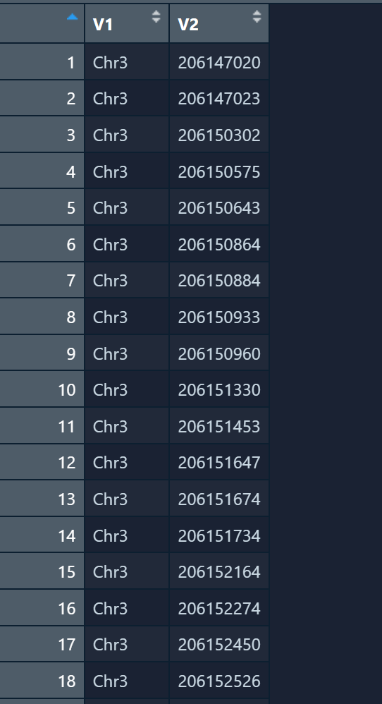
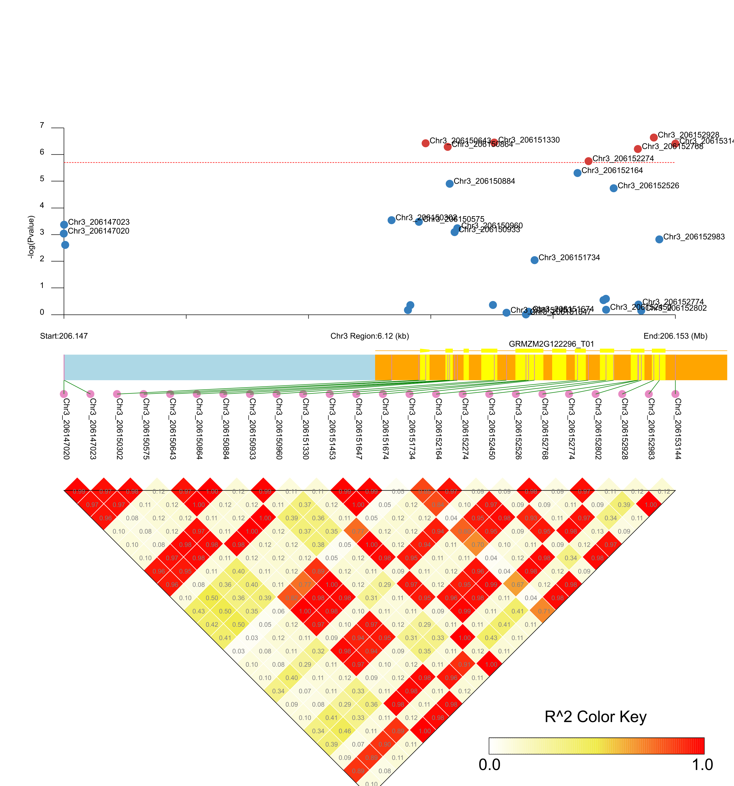

# 获得site文件

```
#!/bin/sh
#$ -S /bin/sh
echo Start Time : 
date
# pvalue 2个
# chr
# star end
# Cutline
# file.svg
# mv
cd /home/data/liangfei/LDBlockShow/example/Example3/
# yanglu
../../bin/LDBlockShow   -InVCF   /home/data/liangfei/LDBlockShow-data/125M_modify.vcf   -OutPut  out -InGWAS /home/data/liangfei/LDBlockShow-data/yanglu/O3YY/O3YY.pvalue  -InGFF  /home/data/liangfei/LDBlockShow-data/ZmB73.gff3   -Region  Chr3:206145037:206156063 -OutPng -SeleVar 2
../../bin/ShowLDSVG    -InPreFix out -OutPut O3YY.svg -InGWAS /home/data/liangfei/LDBlockShow-data/yanglu/O3YY/O3YY.pvalue  -Cutline  5.7  -InGFF  /home/data/liangfei/LDBlockShow-data/ZmB73.gff3  -crGene yellow:orange:pink:lightblue -showNum -OutPng
mv O3YY.svg /home/data/liangfei/LDBlockShow-data/yanglu/O3YY/

date

```


# R处理文件

```
df <- read.delim("E:/count/新建文件夹 (18)/out.site",header = FALSE)
df2 <- df %>% 
  mutate(V3 = paste0(V1,"_",V2)) %>% 
  write.table("Spe.snp",
              quote = FALSE,
              row.names = FALSE,
              col.names = FALSE,sep='\t')
```
# 加标签

```
# 加标签
cd /home/data/liangfei/LDBlockShow/example/Example3/
# yanglu
../../bin/LDBlockShow   -InVCF   /home/data/liangfei/LDBlockShow-data/125M_modify.vcf   -OutPut  out -InGWAS /home/data/liangfei/LDBlockShow-data/yanglu/O3YY/O3YY.pvalue  -InGFF  /home/data/liangfei/LDBlockShow-data/ZmB73.gff3   -Region  Chr3:206145037:206156063 -OutPng -SeleVar 2
../../bin/ShowLDSVG    -InPreFix out -OutPut O3YY.svg -InGWAS /home/data/liangfei/LDBlockShow-data/yanglu/O3YY/O3YY.pvalue  -Cutline  5.7  -InGFF  /home/data/liangfei/LDBlockShow-data/ZmB73.gff3 -SpeSNPName /home/data/liangfei/LDBlockShow-data/yanglu/O3YY/Spe.snp -ShowGWASSpeSNP -crGene yellow:orange:pink:lightblue -showNum -OutPng
mv O3YY.svg /home/data/liangfei/LDBlockShow-data/yanglu/O3YY/

date

```
