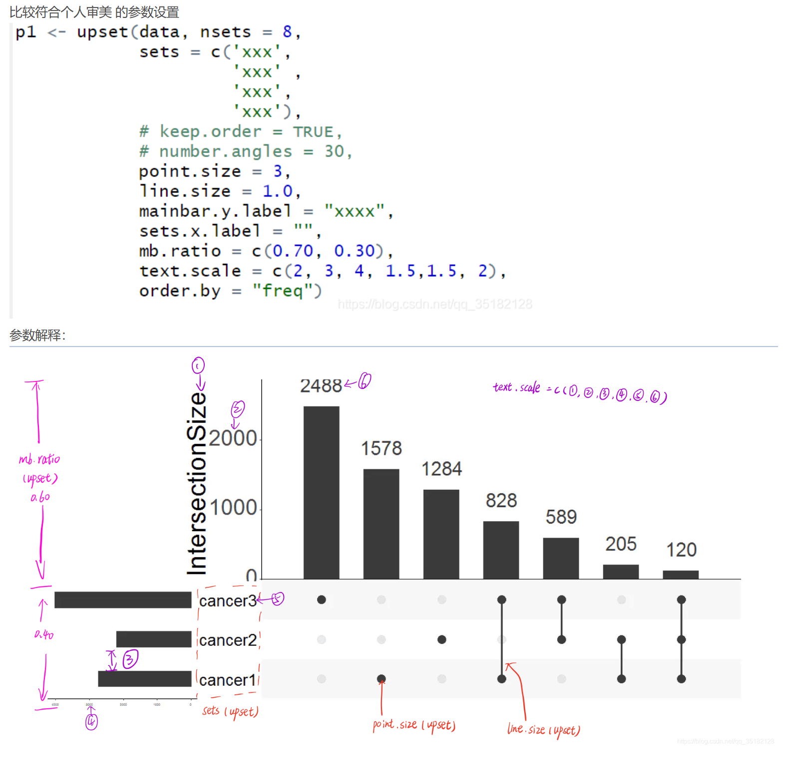

### upset图参数设置

### 利用Emmax进行GWAS分析

```
mkdir myGWAS
cd ~/myGWAS
ln -s /home/data/liangfei/maize_GWAS_file/gwas_file/125M.vcf.gz 125M.vcf.gz
# 解压
zcat "125M.vcf.gz" > 125M.vcf
# 1 使用plink转换成emmax可以识别的格式
plink --vcf 125M.vcf --indep-pairwise 100 50 0.2 --out snp.int0.8maf0.05 --allow-extra-chr --make-bed #过滤SNP数据窗口大小为100kb, 每次扫描 50个SNP,过滤标准为LD 0.2
plink --bfile snp.int0.8maf0.05 --extract snp.int0.8maf0.05.prune.in --out prunData --recode 12 --allow-extra-chr #admixture格式，生成群体结构文件
plink --bfile snp_miss0.1_DP20 --recode12 --output-missing-genotype 0 --transpose --out snp_miss0.1_DP20 #生成emmax格式文件
./emmax-kin snp_miss0.1_DP20 -v -d 10 #利用emmax生成亲缘关系矩阵（kinship）


plink --vcf 125M.vcf --maf 0.05 --geno 0.1 --recode vcf-iid --out test.maf0.05.int0.9
plink --vcf test.maf0.05.int0.9.vcf --indep-pairwise 50 10 0.2 --out test.maf0.05.int0.9
plink --vcf test.maf0.05.int0.9.vcf --make-bed --extract test.maf0.05.int0.9.prune.in --out test.maf0.05.int0.9.prune.in
plink --bfile test.maf0.05.int0.9.prune.in --recode vcf-iid --out test.maf0.05.int0.9.prune.in
plink -bfile test.maf0.05.int0.9.prune.in --recode 12 --out test.maf0.05.int0.9.prune.in
plink --vcf test.maf0.05.int0.9.vcf --recode 12 transpose --output-missing-genotype 0 --out test.maf0.05.int0.9 --autosome-num 90


# emmax-kin test.maf0.05.int0.9 -v -h -d 10 -o test.maf0.05.int0.9.BN.kinf

## 如果你下载的emmax软件是inter这个版本的，这里需要注意，命令有点不同
# emmax-kin-inter64 test.maf0.05.int0.9 -v -d 10 -o test.maf0.05.int0.9.BN.kinf

# cd ~/myGWAS
# emmax-kin test.maf0.05.int0.9 -v -h -d 10 -o test.maf0.05.int0.9.BN.kinf

# emmax-kin test.maf0.05.int0.9.tfam -v -h -d 10 -o test.maf0.05.int0.9.BN.kinf

emmax-kin -v -d 10 test.maf0.05.int0.9


# 激活conda
conact
conda list
# conda activate myenv


for i in {1..15}
do
admixture --cv test.maf0.05.int0.9.prune.in.ped ${i} -j48 >> log.txt
done
```
https://taoyan.netlify.app/post/2019-02-27.%E5%88%A9%E7%94%A8emmax%E8%BF%9B%E8%A1%8Cgwas%E5%88%86%E6%9E%90/