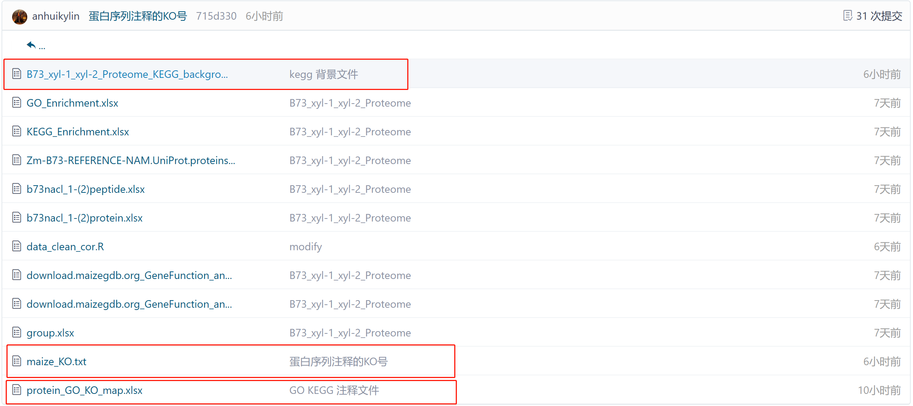

[KEGG背景文件.R](https://gitee.com/anhuikylin/b73_xyl-1_xyl-2_-proteome/blob/master/code/KEGG%E8%83%8C%E6%99%AF%E6%96%87%E4%BB%B6.R)
[ protein_GO_KO_map.xlsx ](https://gitee.com/anhuikylin/b73_xyl-1_xyl-2_-proteome/blob/master/data/protein_GO_KO_map.xlsx)
[data/B73_xyl-1_xyl-2_Proteome_KEGG_background.xlsx](https://gitee.com/anhuikylin/b73_xyl-1_xyl-2_-proteome/blob/master/data/B73_xyl-1_xyl-2_Proteome_KEGG_background.xlsx)
[maize_KO.txt ](https://gitee.com/anhuikylin/b73_xyl-1_xyl-2_-proteome/blob/master/data/maize_KO.txt)
