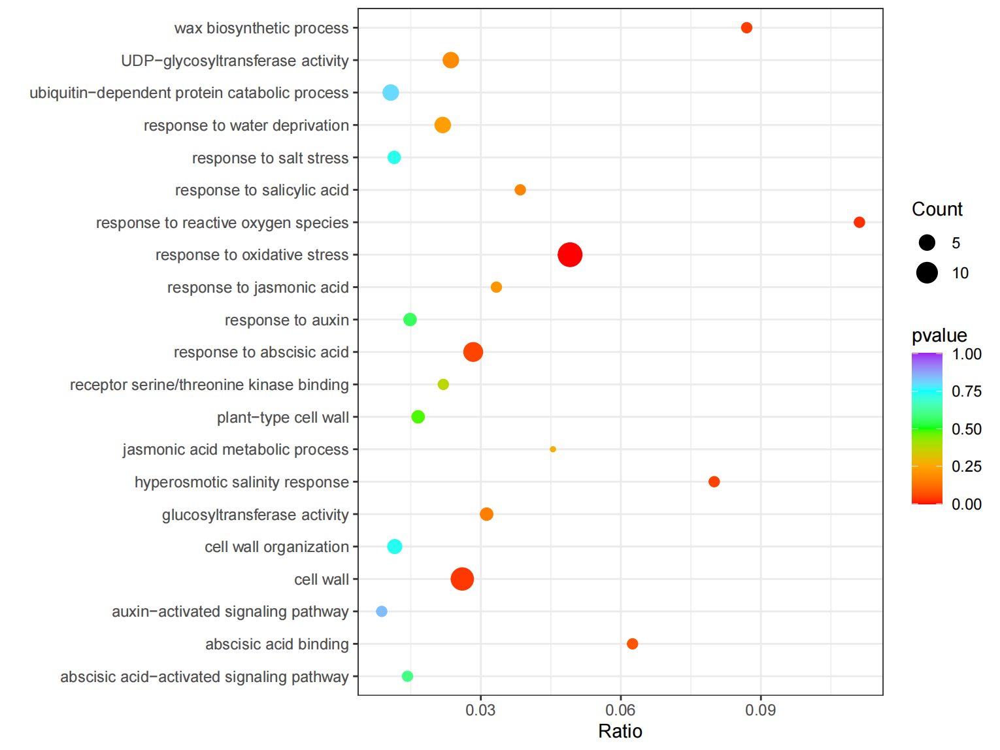

### clusterProfiler结果重新绘制富集气泡图重新

```
library(openxlsx)
library(ggplot2)
library(tidyr)
library(tidyverse)

# sheet1 ------------------------------------------------------------------


df <- read.xlsx("NaCl b73 vs NaCl XYL(1).xlsx")
df1 <- df %>% 
  separate(GeneRatio, into = c("GeneRatio_1", "GeneRatio_2"), sep = "/") %>% 
  separate(BgRatio, into = c("BgRatio_1", "BgRatio_2"), sep = "/") %>% 
  mutate(Ratio = as.numeric(GeneRatio_1)/as.numeric(BgRatio_1))


ggplot(df1,aes(y = Description,x =Ratio,col = pvalue,size = Count))+
  geom_point()+
  theme_bw()+  
  #theme(panel.grid = element_blank())+
  scale_color_gradientn(colours = c('red','orange','green','cyan','purple'),
                        limits = c(0,1),
                        breaks=c(0.00,0.25,0.5,0.75,1.00))+
  labs(y = "")
ggsave("b73_vs_xyl1.pdf",width = 8,height = 6)
# sheet2 ------------------------------------------------------------------


df <- read.xlsx("NaCl b73 vs NaCl XYL(1).xlsx",sheet = 2)
df1 <- df %>% 
  separate(GeneRatio, into = c("GeneRatio_1", "GeneRatio_2"), sep = "/") %>% 
  separate(BgRatio, into = c("BgRatio_1", "BgRatio_2"), sep = "/") %>% 
  mutate(Ratio = as.numeric(GeneRatio_1)/as.numeric(BgRatio_1))


ggplot(df1,aes(y = Description,x =Ratio,col = pvalue,size = Count))+
  geom_point()+
  theme_bw()+  
  #theme(panel.grid = element_blank())+
  scale_color_gradientn(colours = c('red','orange','green','cyan','purple'),
                        limits = c(0,1),
                        breaks=c(0.00,0.25,0.5,0.75,1.00))+
  labs(y = "")
ggsave("b73_vs_xyl2.pdf",width = 8,height = 6)
```
